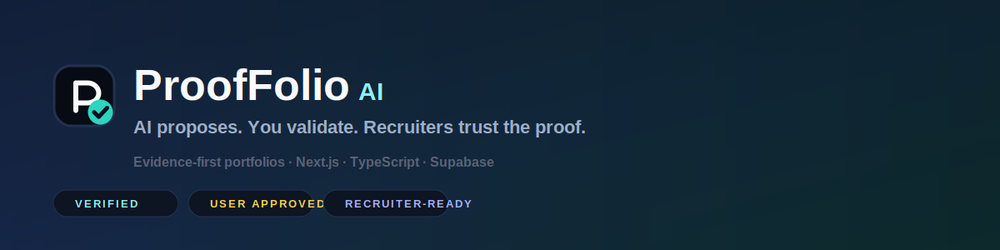
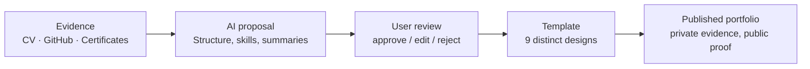
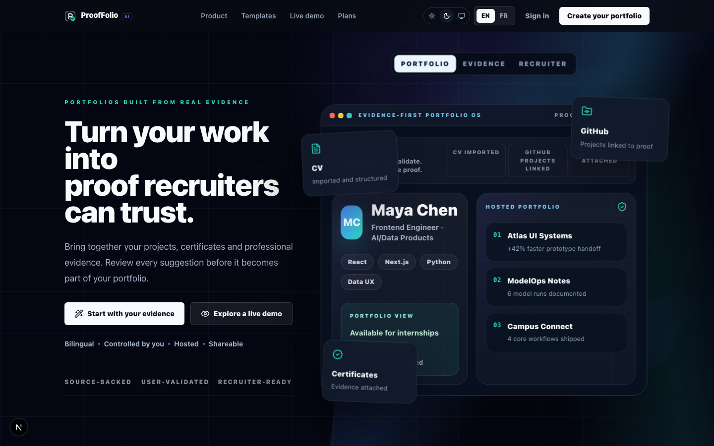
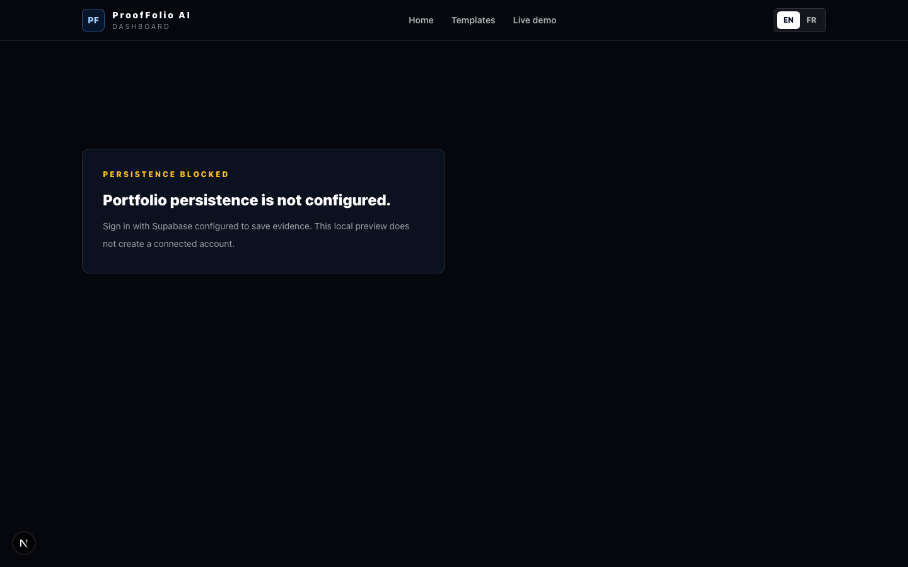
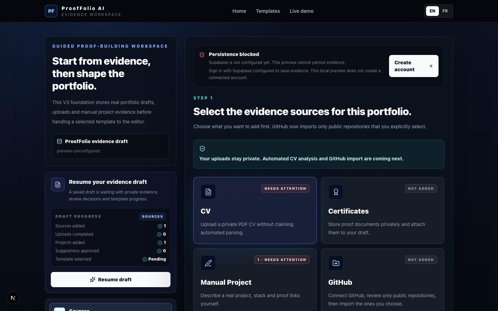
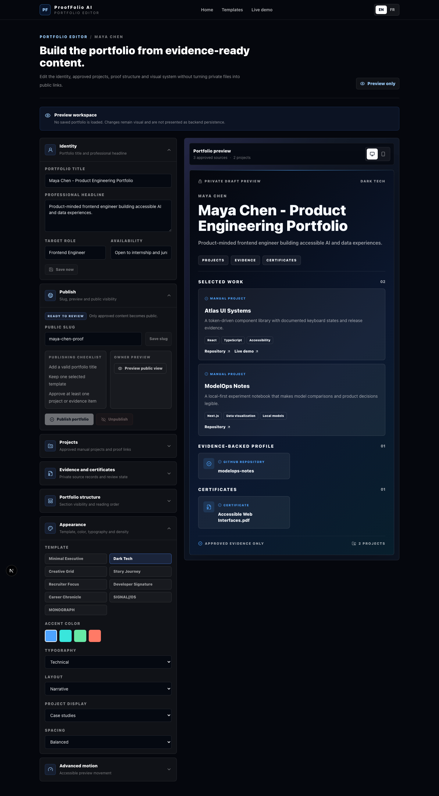
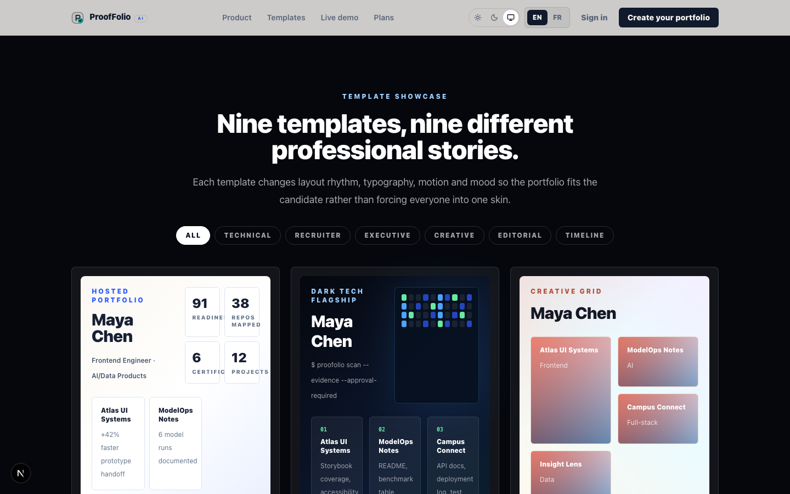
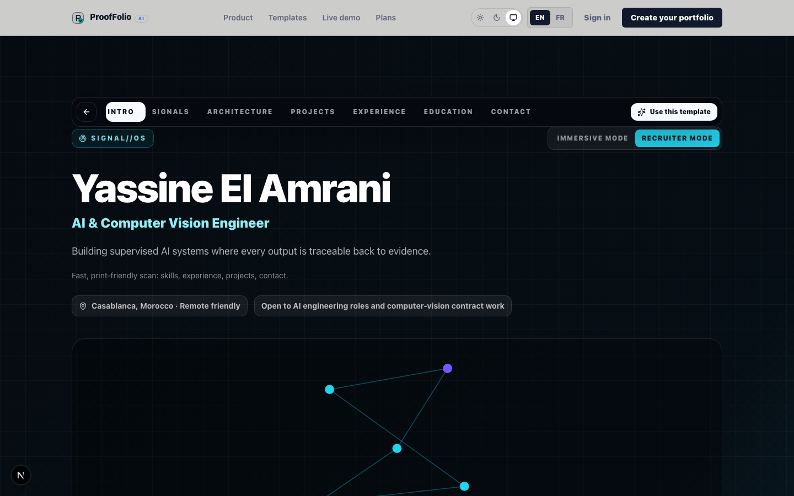
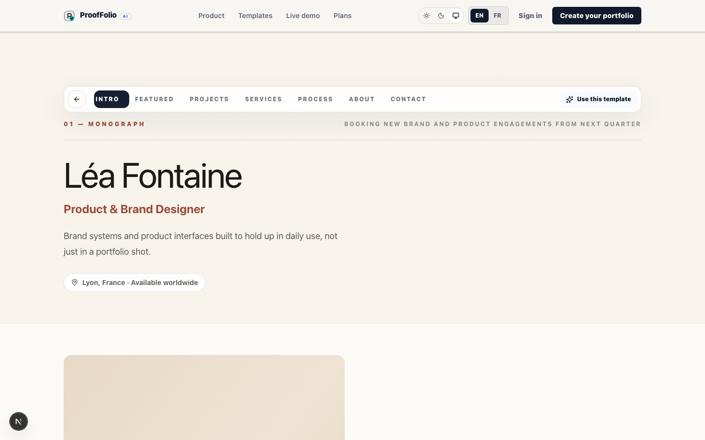

<p align="center">
  
</p>

<p align="center">
  <strong>AI proposes. You validate. Recruiters trust the proof.</strong>
</p>

## What this is

ProofFolio AI is a bilingual (EN/FR) product demo for turning real career evidence — CV
details, GitHub repositories, certificates, manual project write-ups — into a portfolio a
recruiter can actually trust, because every claim on it traces back to something the
candidate uploaded, connected, or approved.

The product's core discipline is that **AI never publishes anything by itself**. It proposes
structure — summaries, skill signals, project descriptions, a recommended template — and a
human reviews, edits, approves, or rejects each suggestion before it becomes part of a public
portfolio. Evidence stays private until the owner explicitly publishes.

## How evidence becomes a portfolio



## Feature overview

- **Brand & theme** — an original ProofFolio AI mark (`src/components/brand/logo.tsx`), and a
  real Light / Dark / System theme (`src/components/theme/`) with no-flash hydration, applied
  across the marketing chrome, dashboard, onboarding, and editor.
- **Nine portfolio templates** — seven upgraded originals plus two new flagship templates,
  all selectable from the gallery and the editor (see the table below).
- **Evidence-first onboarding** — `/onboarding` walks through sources (CV, GitHub, certificates,
  manual projects), a simulated AI proposal queue, and explicit user approval.
- **Persistent editor** — `/editor` edits identity, approved projects, evidence, template,
  and design settings, with a live desktop/mobile preview and Draft → Saving → Saved states.
- **Authenticated shell** — dashboard, account settings, sidebar/topbar, mobile navigation,
  optional Google / GitHub / LinkedIn sign-in (identity-only, feature-flagged).
- **Public publishing** — `/p/[slug]` renders only user-approved content; private evidence is
  never exposed.
- **Bilingual UI** — every string above ships in English and French via
  `src/lib/content.ts` / `useLocale()`.

## Screenshots

| Landing | Dashboard | Onboarding |
| --- | --- | --- |
|  |  |  |

| Editor (nine templates) | Template gallery |
| --- | --- |
|  |  |

| SIGNAL//OS | MONOGRAPH |
| --- | --- |
|  |  |

A full 13-shot visual QA set (light/dark, desktop/mobile, both new templates in both modes)
lives in `docs/visual-qa/final-presentation/`.

## The nine templates

| # | Template | Category | Best for |
| - | --- | --- | --- |
| 1 | Minimal Executive | Executive | Business-facing technical candidates who want restrained, editorial polish |
| 2 | Dark Tech | Technical | Builders who want an "observatory" feel — signals, evidence drawer, ambient depth |
| 3 | Creative Grid | Creative | Designers/creative technologists — filterable, varied-size project gallery |
| 4 | Story Journey | Timeline | Candidates narrating a career change via a scroll-driven chapter rail |
| 5 | Recruiter Focus | Recruiter | A 30-second scan: role, top projects, stack, proof, contact |
| 6 | Developer Signature | Technical | Shipped-work-first: project impact, build history, toolkit clusters, evidence drawer |
| 7 | Career Chronicle | Timeline | Chronology-first: year navigation, milestones, certification progression |
| 8 | **SIGNAL//OS** *(new)* | Technical | AI/ML/CV/security engineers — Immersive signal-map mode + a fast Recruiter mode |
| 9 | **MONOGRAPH** *(new)* | Editorial | Product/brand/creative designers — editorial paper aesthetic, 3 index modes |

## Tech stack

- Next.js 16 (App Router, Turbopack), React 19, TypeScript
- Tailwind CSS v4
- framer-motion (shared motion tokens in `src/lib/motion.ts`, reduced-motion respected
  globally via `MotionConfig`)
- `@react-three/fiber` / `three` — optional, dynamically imported, used only for SIGNAL//OS's
  Immersive-mode signal map; every other surface is 2D
- Supabase (`@supabase/ssr`, `@supabase/supabase-js`) — Auth, Postgres, Storage, RLS
- Playwright (`@playwright/test`, `@axe-core/playwright`) for E2E and accessibility checks

## Architecture summary

- `src/lib/content.ts` — the single bilingual copy object (`copy.en` / `copy.fr`) that drives
  every template, section, and UI string; `templateIds` / `templateMeta` / `templateCategories`
  are the template registry.
- `src/components/living-templates.tsx` — dispatches a `TemplateId` to its React component.
- `src/components/templates/template-shell.tsx` — shared chrome for every template: section
  nav with a sliding active indicator, scroll progress, "Use this template" CTA.
- `src/components/theme/` — `ThemeProvider` / `useTheme()` + a no-flash inline script in
  `src/app/layout.tsx`; theme tokens live in `src/app/globals.css` under
  `:root[data-theme="light"]`. Global chrome (nav, footer, app shell, dashboard, editor,
  onboarding) is theme-aware; each portfolio template keeps its own designed tone (light or
  dark) as part of its brand, the same way a template's colors don't change just because the
  *builder's* UI theme changes.
- `src/lib/editor/` and `src/lib/onboarding/` — the editor's persisted-draft shape and the
  onboarding flow's types, both independent from the template copy model above.
- `src/app/p/[slug]/page.tsx` + `src/lib/public-portfolios.ts` — public rendering of only
  approved, published content.

## Route inventory

| Route | Notes |
| --- | --- |
| `/` | Marketing landing page |
| `/demo` | Live interactive demo |
| `/templates`, `/templates/[id]` | Gallery + all 9 living template routes |
| `/auth/sign-in`, `/auth/sign-up` | Email/password + optional OAuth |
| `/auth/callback`, `/auth/github`, `/auth/github/callback` | OAuth/evidence-import callbacks |
| `/dashboard` | Authenticated home |
| `/account` | Account settings |
| `/onboarding` | Evidence-first guided draft flow |
| `/editor` | Persistent portfolio editor |
| `/p/[slug]` | Public, published-only portfolio view |

## Setup

```bash
npm install
cp .env.example .env.local   # fill in your own Supabase project values
npm run dev                  # http://127.0.0.1:3210
```

## Environment variables

See `.env.example` for the full list with inline comments. No secrets are committed. In
short: `NEXT_PUBLIC_SUPABASE_URL` / `NEXT_PUBLIC_SUPABASE_ANON_KEY` enable the real backend
(auth, evidence storage, persistence); everything else is optional and feature-flagged —
leaving a flag unset hides the related UI instead of rendering a non-functional button.

## Tests

```bash
npm run lint
npm run build
npm run test:e2e
```

`tests/smoke.spec.ts` and `tests/account-shell.spec.ts` cover: all public/template routes with
no console errors and no horizontal overflow, locale switching, the theme toggle, all nine
editor template options, onboarding and auth flows, and visual-QA screenshot capture.
Credential-dependent tests (`E2E_TEST_EMAIL` / `E2E_TEST_PASSWORD` / a configured Supabase
project) skip automatically when those aren't present — this is intentional, not a gap in
coverage; see "Known limitations" below.

## Implemented today

- Original brand system (logo, favicon, Light/Dark/System theme with persistence and no
  incorrect-theme flash)
- Nine distinct template designs, all wired into the gallery, the template detail routes, and
  the editor's template picker
- Bilingual EN/FR UI across marketing, templates, onboarding, editor, and account
- Supabase-backed auth, private evidence upload, manual project persistence, proposal review
  state, template selection, and publish/unpublish, once Supabase env vars + migrations are in
  place
- A shared motion vocabulary (instant/standard/panel/reveal timing bands + a selection spring)
  applied to nav indicators, template selection, section reveals, and the SIGNAL//OS /
  MONOGRAPH interaction modes

## Honest limitations

- No live Google/GitHub/LinkedIn OAuth, Supabase migrations, payments, real CV parsing, or
  real AI provider integration were configured or verified in this pass — see "Remaining setup"
  below.
- The marketing landing page's rich content sections (hero, workflow, proof, pricing) keep
  their original dark-first visual treatment; only the persistent chrome (nav, footer,
  dashboard, editor, onboarding) is fully theme-aware in this pass. Each portfolio *template*
  correctly keeps its own designed light/dark tone regardless of the site theme — that part is
  intentional, not a gap.
- SIGNAL//OS's Immersive mode uses a lightweight, dynamically-imported `@react-three/fiber`
  scene as an optional visual layer over a static SVG signal map — it is decorative, not
  navigation-critical, and Recruiter mode never loads it.
- `favicon.ico` is still the default Next.js placeholder; the modern `icon.svg` (this project's
  actual mark) takes precedence in browsers that support it.

## Roadmap

- Full landing-page section-level light/dark theming (beyond the current chrome-level theming)
- Live OAuth verification once real provider credentials are available
- Real CV parsing and AI provider integration behind the existing disabled-by-default adapter
- Payments/subscriptions, analytics, moderation, admin tooling

## Credits

Built by Anas Lahraoui with Claude Code, on top of the existing V3 Supabase foundation
(auth, onboarding, editor, publishing) from prior sprints on this branch.

## Five-minute presentation path

1. `/` — hero, evidence sources, workflow (AI proposal + approval), template gallery teaser,
   recruiter trust section, pricing.
2. Toggle the theme control in the nav (Light/Dark/System) to show it persists and applies
   across the app shell.
3. `/templates` — filter by category, point out the **New** badges on SIGNAL//OS and MONOGRAPH.
4. `/templates/signal-os` — switch Immersive ↔ Recruiter mode.
5. `/templates/monograph` — switch Visual / Text / Chronological project index modes.
6. `/onboarding` — evidence sources → simulated AI proposal → approval.
7. `/editor` — show the 9-template picker and the live preview.
8. `/dashboard` and `/account` — the authenticated shell (theme toggle in the user menu on
   mobile widths).

## Remaining manual connection setup for the product owner

- Configure a real Supabase project (`NEXT_PUBLIC_SUPABASE_URL` / `NEXT_PUBLIC_SUPABASE_ANON_KEY`)
  and run the migrations under `supabase/` to enable persistence end to end.
- Register and enable Google / GitHub / LinkedIn OAuth apps per `docs/V3_SOCIAL_AUTH_SETUP.md`
  if social sign-in is wanted; each stays hidden until its flag is set.
- Replace `favicon.ico` with a rasterized export of `docs/readme-assets/logo-mark.svg` if a
  legacy `.ico` fallback is desired for older browsers.
- Decide whether to extend full light/dark theming into the marketing landing page's content
  sections (currently chrome-only), per "Honest limitations" above.
